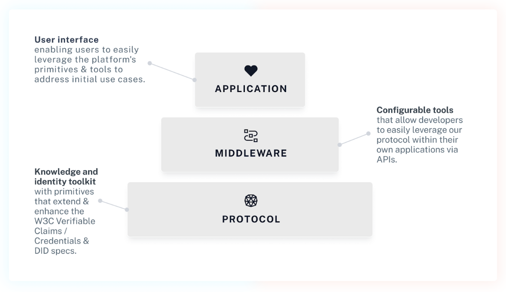
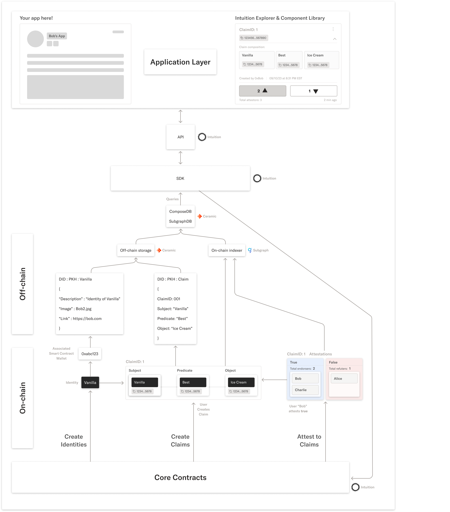

# 🏗 Architecture


This is a high-level overview of the overall architecture and sub-components of the Intuition Platform.


### Architecture Overview

Intuition is creating an **open social knowledge graph**, capturing the wisdom of the crowds about anything in a way that’s **structured, permissionless, and fully decentralized**. The resulting qualitative data can be used by anyone for any arbitrary purpose, enhancing the information we have access to regarding the myriad of things we interact with day to day, whether it’s a pseudonym, a smart contract, an organization or a piece of content.

The platform can be broken down into 3 layers:&#x20;

1\) Infrastructure/Protocol&#x20;

2\) Middleware

3\) Application

<figure><figcaption></figcaption></figure>

### Infrastructure Layer Overview

Intuition’s infrastructure facilitates the **creation of decentralized identity and reputation data via peer-to-peer attestations about any subject and its decentralized identifier (DID)**. If someone endorses you as trustworthy, that metadata will no longer be associated with just the LinkedIn you, or the Twitter you. Instead of being stuck within a given platform, the knowledge tied to DIDs can be leveraged and contributed to by any application.

### Middleware Layer Overview

Although we’re building an application to help demonstrate our infrastructure, our primary goal is to facilitate a healthy ecosystem of developers and partners integrating, building and experimenting on top of Intuition. We’re initially handholding some close strategic partnerships, but are also **making it easy and permissionless for developers to integrate attestation functionality into their own applications** while retaining frontend flexibility and control.

### Applications Layer Overview

Intuition’s **initial application allows users to create and navigate attestations regarding people and things within the web3 ecosystem**, a space where qualitative reputation and identity data is acutely lacking. Leveraging users’ social graphs (i.e., the people and organizations they “follow”) and distributed trust algorithms (e.g., EigenTrust), the application will be able to prioritize the display of relevant activity and tailor attestation weighting. Our in-house application(s) are built with composability and reusability in mind, in an attempt to make it as easy as possible for others to also build on top of Intuition through the open-sourcing of our front-end libraries.

### On-Chain[^1]

The present state of the Intuition Core Contracts includes the following functionality:

* Identity creation and the instantiation of their associated Smart Contract Wallets
* Claim creation and the instantiation of the associated storage for Attestations "For" and Attestations "Against"
* State of the Attestations made about the existing Claims

### Off-Chain

* All rich/heavy metadata pertaining to Identity and Claims is stored off-chain, such as pictures, long-form descriptions, and references.
* All system data is aggregated off-chain to enable ease of querying

## Analogy

NFTs are a common example of where you blend on and off-chain components to gain the benefits of on-chain ownership, immutability with off-chain rich metadata and flexibility.

While the contract mints the ERC-721 and is stored as token on-chain with transfers and ownership records, the detailed metadata is stored off-chain.


Our system leverages Ceramic Network for off-chain data storage purposes, so Intuition never owns any of this data!


<figure><figcaption></figcaption></figure>

[^1]: 
