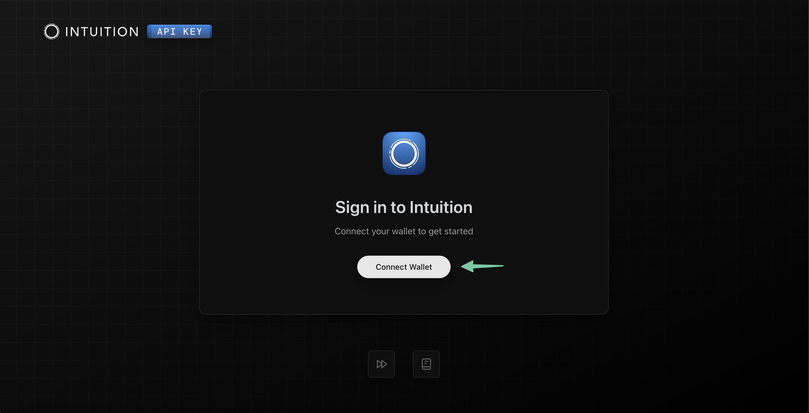
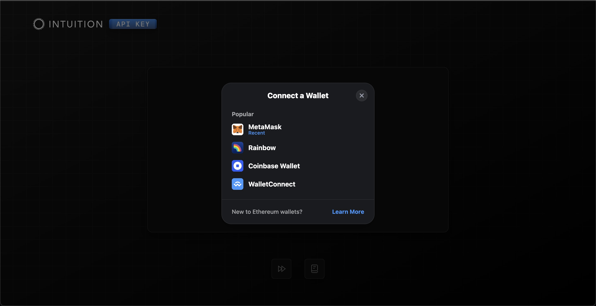
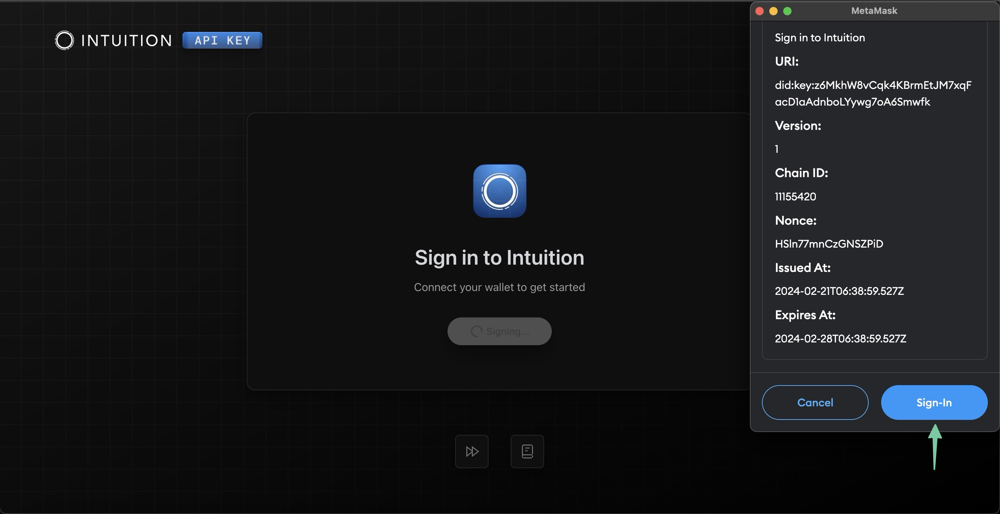
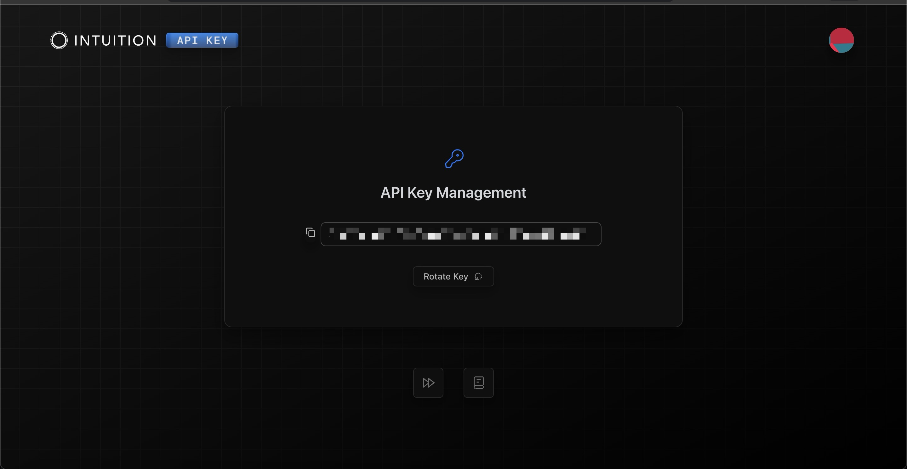

# ⚡ Dev Quick Start

### Starting&#x20;

This guide contains resources and links to help you get started building on top of Intuition. These steps provide the most direct way to get up and running with our resources. We'll continue to refine and improve this process so be sure to check back for improvements as we receive developer feedback!

You can either read through the next section for a step-by-step walkthrough or [jump right to our video tutorial.](dev-quick-start.md#tutorial-video)

### Getting Your API Key

You need an Intuition API Key to use our public API. We've provided an [API Key Portal](https://intuition.sh) for quick access to generating and retrieving your API key.&#x20;

**Prerequisites:** This section assumes that you have an Ethereum wallet and the ability to sign messages through MetaMask, Rainbow, or another supported provider.

#### Step 1:

First, navigate to our [API Key Portal](https://intuition.sh) and click on the _Connect Wallet_ button:

<figure><figcaption>
Click on the Connect Wallet button
</figcaption></figure>

#### Step 2:

Choose which wallet you want to use to connect:

<figure><figcaption>
Choose which wallet you want to use.
</figcaption></figure>

#### Step 3:

Click the _Sign-in_ button on your wallet. This will look different depending on your wallet. You'll need to sign the message in your wallet.

Here's an example from MetaMask:

<figure><figcaption>
Sign the message in your wallet.
</figcaption></figure>

#### Step 4:

Your API Key will be generated the first time that you connect and sign with a new address. The key is connected to your Ethereum address.

You can revisit this page at any point if you need to view and copy your API Key:

<figure><figcaption>
View and copy your API Key.
</figcaption></figure>

You can also refresh your API Key from the Portal once you're connected.&#x20;

🎉 Congratulations you now have your API Key! Be sure to copy your API Key and keep it somewhere safe as you'll need it for all of your API requests.&#x20;

Check out our [API Key Authentication](../api/api-key-authentication.md) page for more information about authenticating with your API Key.


#### Your API Key is tied to your Ethereum Address that you signed with in the API Key Portal.  Be sure to keep it safe!


### Tutorial Video


Here is a Quick Start Onboarding video that covers the process outlined in the guide.


### Next Steps

Once you have your API Key you're ready to start building! You can dive right in by cloning one of our "batteries included" starters or explore our documentation for our API, contract interactions, and protocol.

<table data-view="cards"><thead><tr><th></th><th></th><th></th><th></th><th data-hidden data-card-target data-type="content-ref"></th></tr></thead><tbody><tr><td></td><td>🪄 Starter Templates</td><td>Clone one of our starter templates and start building.</td><td></td><td><a href="../guides/starter-templates.md">starter-templates.md</a></td></tr><tr><td></td><td>🪄 <strong>Explore our API</strong></td><td>Explore our API docs and begin interacting with our public REST API.</td><td></td><td><a href="broken-reference">Broken link</a></td></tr><tr><td></td><td>🪄 <strong>Contract Interactions</strong></td><td>Explore our onchain contract interaction examples.</td><td></td><td><a href="broken-reference">Broken link</a></td></tr><tr><td></td><td>🪄 <strong>Protocol and Contracts</strong> </td><td>Read through our protocol and contract documentation.</td><td></td><td><a href="broken-reference">Broken link</a></td></tr></tbody></table>

### Getting in Touch

We welcome feedback! Please reach out with questions, suggestions, and to share what you've been building! As we build our developer community we'll be expanding our available resources. We're excited to welcome and support builders.

* For more on Intuition visit [intuition.systems](https://intuition.systems), follow us on [Twitter](https://twitter.com/0xIntuition), and join our [Discord](https://discord.gg/RcASAxbpHf)
* For developer inquiries email [devrel@intuition.systems](mailto:devrel@intuition.sysstems)

### Links

* [Intuition API Key Portal](https://intuition.sh)
* [Intuition Portal](https://portal.intuition.systems)
