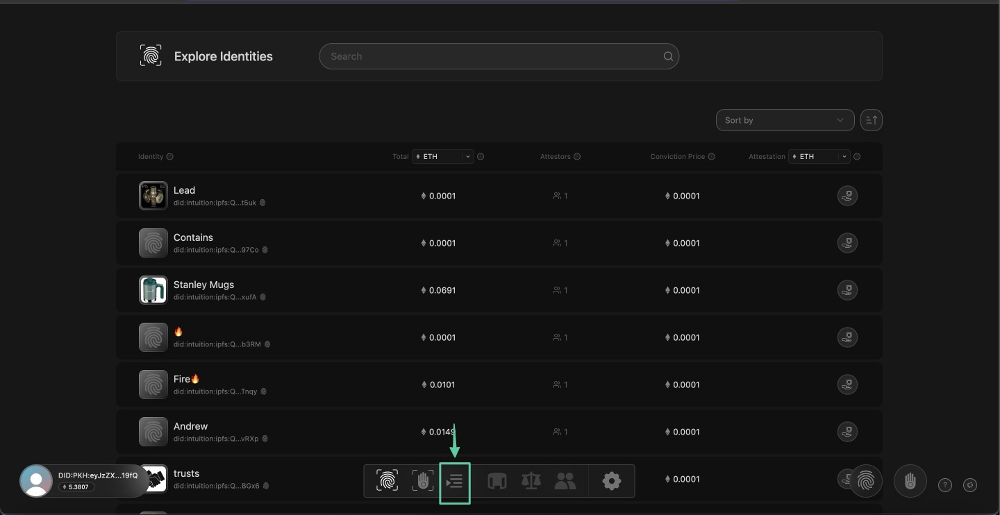
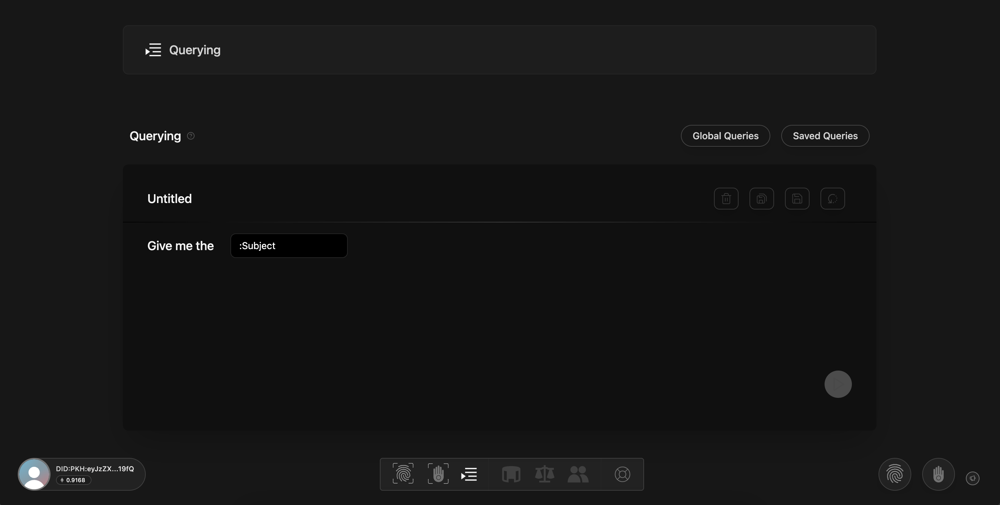
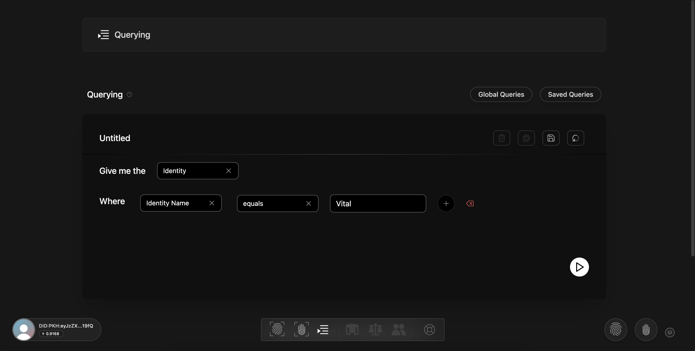
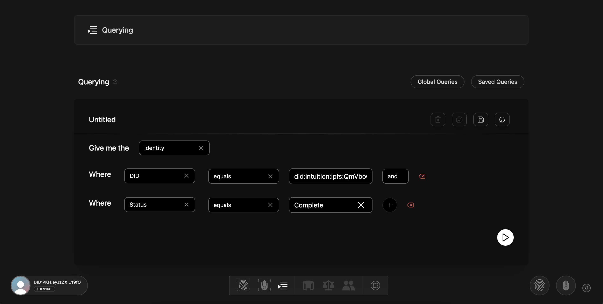

# Querying

## Querying

In Intuition, querying is more than just a feature—it's central to our ethos.

The [Portal Query Builder](https://portal.intuition.systems/app/query) feature enable users to compose and run their own queries for finding specific Identities or Claims within our system more efficiently. Query Builder is designed with a focus on enhancing user experience and efficiency through providing customization and reusability of queries.&#x20;

Let's explore key features:

#### Composing and Searching Queries&#x20;

Query Builder allows users to selectively search for Identities or Claims based on specific attributes. It presents an interface where users can define search criteria over the properties of Identities or Claims.&#x20;

Example: Users can construct a Query to locate all "Identities where the display name contains a certain keyword" or "Claims where the creator possesses a specific ID."

This ability to create targeted searches empowers users to retrieve highly specific sets of data. The formulation of Queries based on unique properties caters to the specific needs of the users  and greatly increases the accuracy and relevance of the results.

#### Executing Queries and Retrieving Results&#x20;

Once a Query is composed, users can run it directly from the Query Builder page. The system will retrieve and display the results based on the parameters specified in the query.&#x20;

This offers a real-time searching ability to the users and helps them get immediate insights without having to navigate away from the page.

#### Saving and Reusing Custom Queries&#x20;

A key feature of the Query Builder is its ability to save custom queries. This means once a user defines a query they like they don't have to compose the same query again for future use.&#x20;

For the moment, we are saving these queries in the local storage of the user's device. However, we are planning to move this feature into a separate API endpoint soon.

#### Utilizing Global Queries&#x20;

Query Builder also has a set of pre-existing "global" Queries. These will cover most common search scenarios allowing users to select and run them right away without spending time configuring their Query.&#x20;

Right now there's only one experimental Query saved but we're in the process of adding more.

### Try It Out

You can begin experimenting with Query Builder on our [Portal](https://portal.intuition.systems) to get a sense for the interactions.&#x20;

You can experiment by navigating to [Portal](https://portal.intuition.systems), connecting your wallet to authenticate, and then you can find Query Builder in the navigation bar:

<figure><figcaption>
Locating the Query Builder icon on the bottom navigation menu.
</figcaption></figure>

You'll see options to explore _Global Queries_ and any _Saved Queries_ that you've created. You can also create a new Query by selecting an item from the dropdown next to the _Give me the_ label.

<figure><figcaption>
Empty Query -- your starting point.
</figcaption></figure>

After your initial selection you'll be able to continue building your Query by composing terms from the dropdowns next to the _Where_ label:

<figure><figcaption>
Building your Query by selecting your Query criteria from the dropdowns.
</figcaption></figure>

You can continue layering additional _Where_ fields to build your Query. When you're ready, you can Save your Query locally, or click the Play button to run your Query.

<figure><figcaption>
Example of a built out Query.
</figcaption></figure>

We're in the process of rolling out additional developer resources for integrating Querying, so keep checking back!
