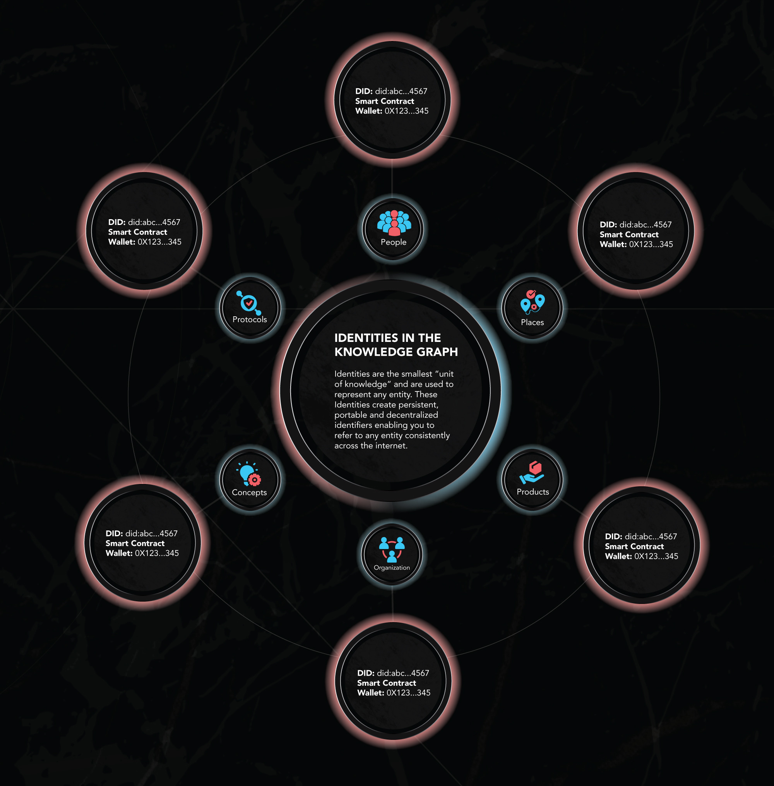

# Identities

### What Are Identities?

**Identities** are the smallest "unit of knowledge" and are used to represent any entity. Identities create persistent, portable, and decentralized identifiers enabling you to refer to any entity consistently across the Internet.

<figure><figcaption></figcaption></figure>

### Understanding Identities

The digital universe is vast, where everything from tangible objects to abstract concepts can be endowed with a digital identity. Identities confer unique recognition and definition to persons, places, ideas, or even memes, ensuring each entity's distinct presence.&#x20;

Within Intuition, every Identity is secured by a unique DID ([Decentralized Identifier](https://www.w3.org/TR/did-core/)) and an Ethereum wallet address, establishing a verifiable foundation.&#x20;

Identities are categorized into three primary roles within semantic structures: **Subjects**, **Predicates**, and **Objects**. This structure facilitates the creation of **Claims** that articulate specific assertions or facts about the world.&#x20;

Let's look at an example in the format of **Subject - Predicate - Object:**

**Alice** \[Subject] **- hasAccessTo** \[Predicate] **- Intuition** \[Object]**.**

* **Alice** is the **Subject**
* **hasAccessTo** is the **Predicate**
* **Intuition** is the **Object**

Further illustrating the flexibility of Identities, **Intuition** can also act as a **Subject:**

* **Intuition** \[Subject] - **is a** \[Predicate] - **Ethereum-based attestation protocol** \[Object].&#x20;

This claim demonstrates Intuition's role and essence in a semantic, structured format.

### Composition of Knowledge

Acknowledging the potential for any entity to hold a digital identity opens the door to collaboratively crafting an expansive knowledge graph. By arranging Identities into Claims—semantic triples of Subject, Predicate, Object—we co-create a graph mapping out entities' interrelations and factual, verifiable assertions about the world.

The journey within Intuition starts with an Identity. Engaging with this concept might begin by identifying entities within your realm of knowledge that fit neatly into the categories of Subjects, Predicates, or Objects. This process is a first step toward contributing to our collective mission: building a collaborative knowledge graph demonstrating the connections and relationships among all entities.
