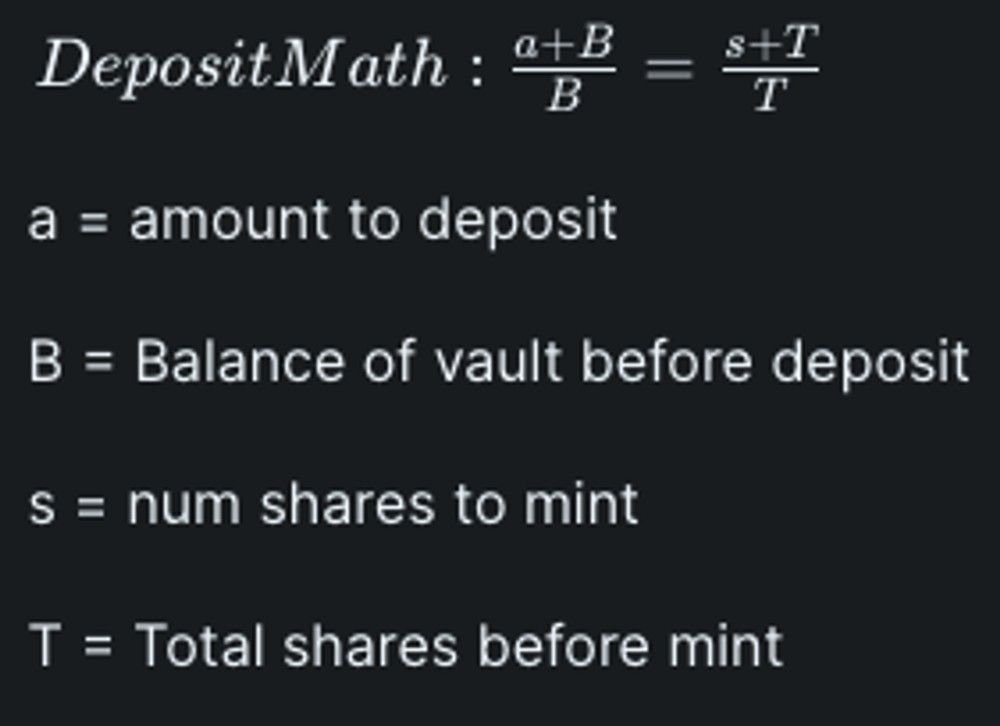
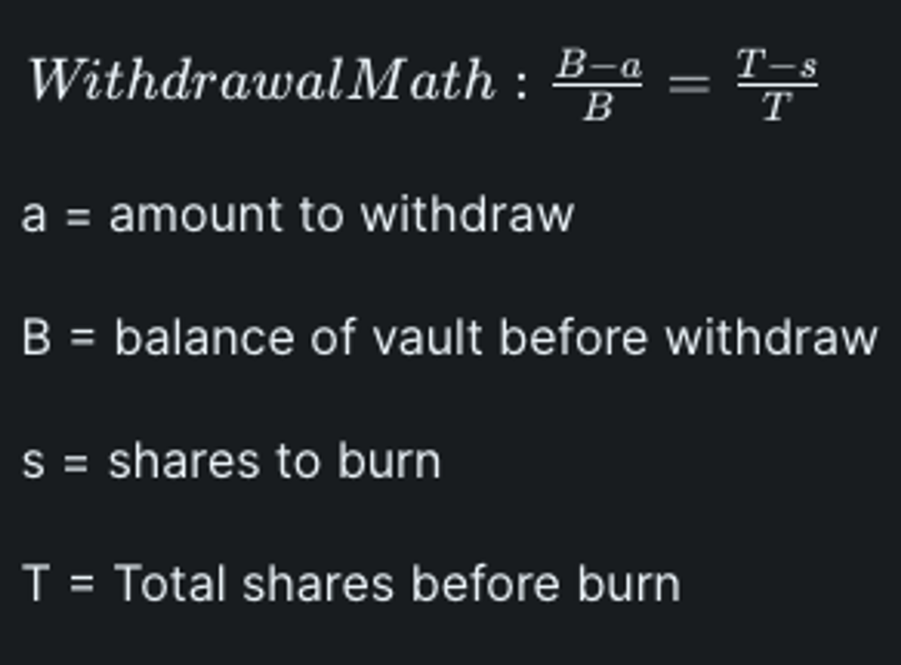

# Deep Dive

### Overview

The EthMultiVault system facilitates the creation of Atoms and Triples, which are essential for building and expanding the Intuition Knowledge Graph. This system allows users to contribute knowledge and insights, leveraging Ethereum (ETH) as a medium of exchange and interaction.

### Atoms

**Atom**: A fundamental unit within the Intuition ecosystem, representing the smallest piece of knowledge. Atoms can embody various forms of data, such as subjects, predicates, objects, or even Triples themselves. They serve as the building blocks for constructing more complex knowledge representations.

Key Features of an Atom:

1. Each Atom is uniquely identified, typically through a URI.
2. Atoms are associated with Ethereum addresses or Smart Contract Wallets.
3. Detailed descriptions and metadata about Atoms are stored on decentralized storage solutions like the Ceramic Network.

While initially, Shares in Atom Vaults cannot be purchased directly, users can acquire Shares by staking on Triples that incorporate specific Atoms. Future iterations may introduce direct Share purchase options for Atoms.

### Creating Atoms

Atom creation involves several steps, including:

* Initiating a dedicated Vault for the Atom.
* Assigning an Atom Identity and generating a corresponding DID using the did:pkh standard.
* Ensuring the Atom's uniqueness within the system.
* Storing detailed Atom metadata on external, decentralized registries for accessibility and transparency.

The creation of an Atom necessitates a fee, which is utilized for:

* Allocating Shares within the Atom's Vault.
* Registering the Atom within the Intuition system for tracking and utilization purposes.

### Triples

**Triple**: Represents a structured knowledge statement within the Intuition ecosystem, formulated as {Subject, Predicate, Object}. Triples are composed of three Atoms and articulate semantic relationships or assertions (see [semantic triple](https://en.wikipedia.org/wiki/Semantic\_triple)).

Triples enable users to craft detailed and meaningful statements, enriching the knowledge graph with semantically structured data. The creation of a Triple involves specifying three constituent Atoms and ensuring the Triple's hash uniqueness to maintain data integrity.

### Creating Triples

The Triple creation process requires users to:

* Supply three Atoms as the Triple's Subject, Predicate, and Object.
* Guarantee the Triple's uniqueness through a unique hash.
* Stake ETH on the Triple, if desired, to express concurrence with its assertion.

When creating a triple, logical and semantic coherence is encouraged to ensure the graph's overall quality and utility.

### Vaults

Vaults are central to the EthMultiVault architecture, managing the economic aspects of knowledge representation. Each Atom and Triple is linked to a Vault, which administers the ETH stakes and Shares related to the knowledge entity.

Conforming to the ERC4626 Tokenized Vault Standard, we extend the functionality to our EthMultiVault standard. ERC4626 is a standard of yield-bearing vaults which represent shares of a single underlying ERC-20 Token. Core functionality of 4626 Vaults includes depositing and withdrawing tokens, as well as reading balances.

By depositing ETH, a user receives pro-rata shares (minus fees) representing ownership of those assets. These shares can then be redeemed for the deposit assets plus any generated rewards at a later point.

<figure><figcaption></figcaption></figure>

 

<figure><figcaption></figcaption></figure>

### Atom & Triple Staking

Staking involves depositing ETH into Vaults corresponding to Atoms or Triples, acquiring Shares in return. This process signifies a user's support for the knowledge entity's validity and grants them a stake in the entity's economic activity, such as accruing fees from future interactions.

In conclusion, the EthMultiVault system presents a robust framework for decentralized knowledge representation, underpinned by economic incentives. By facilitating the creation and engagement with Atoms and Triples, it underlies a participatory and economically driven knowledge graph within the Intuition ecosystem.

### Admin Privileged Operations

The EthMultiVault system is designed with various safeguards to ensure the security and integrity of its operations. Central to these safeguards is the role of the admin, who is endowed with specific privileges enabling the maintenance and adjustment of the system according to evolving needs and circumstances.

### Role of the Admin

The admin plays a crucial role in managing the EthMultiVault contract. This includes the authority to adjust key parameters that influence the contract's behavior and economics. The admin is responsible for:

* Setting and updating the admin address, allowing for transfer of administrative control.
* Designating the protocol vault address, which is a critical recipient of various fees collected by the system.
* Adjusting fee denominators, entry fees, exit fees, and protocol fees to align with the economic model's sustainability and fairness.
* Modifying atom and triple creation fees, influencing the cost of introducing new knowledge units into the system.
* Changing the minimum deposit amount and minimum share threshold, which can impact user participation and vault initialization.

These operations ensure the system remains adaptable, secure, and aligned with the community and project goals.

### Pausability

The EthMultiVault contract incorporates a mechanism to pause specific methods, ensuring user security and safety, and facilitating safe resolutions in emergency situations. This feature is paramount for maintaining the integrity of operations and safeguarding assets under unforeseen circumstances. The following operations can be paused:

* Atom wallet deployment
* Atom & triple creation
* Atom & triple staking (deposits)
* Atom & triple share redemptions (withdrawals)

This pausability feature is crucial for preemptive measures against potential vulnerabilities or during critical updates to ensure uninterrupted and secure service. You can learn more about the methods mentioned above here.

### Emergency Mode

Upon activating the pause function, the contract automatically transitions into emergency mode. This mode is a critical feature that pauses all functions listed in the Pausability section and activates specific methods for emergency withdrawals of assets from atom and triple vaults. Emergency withdrawals are executed in batches and are solely performed by the contract admin. This measure is a last resort, employed when the contract cannot be upgraded safely or in scenarios where an immediate intervention is required for asset protection.

### Upgradeability

The current architecture of our EthMultiVault contract utilizes the EIP-1967 Transparent Proxy pattern, specifically through the `TransparentUpgradeableProxy` by OpenZeppelin. This pattern ensures that the contract remains transparent and upgradeable, aligning with our commitment to transparency and community trust. The upgrade process is managed by a separate ProxyAdmin contract, which is presently controlled by an address associated with our team. However, plans are underway to transition this mechanism to a multisig arrangement, potentially incorporating prominent community members. This evolution aims to bolster trust and decentralize administrative control, enhancing the security and resilience of the contract's upgradeability.

### Transition to Multi-Sig Wallet Administration

The EthMultiVault's admin functions are currently managed by an Externally Owned Account (EOA) controlled by our core team, a setup chosen for its efficiency during the testnet phase. This approach ensures rapid response to development needs and security concerns, facilitating smooth project progression.

However, in alignment with our dedication to decentralization, we plan to shift admin control to a multi-signature (multi-sig) wallet post-mainnet launch. This transition will distribute administrative responsibilities among selected community members and stakeholders, enhancing security and decentralizing governance. Such a move underscores our commitment to community trust and transparency, reflecting the broader blockchain ethos of distributed control.
